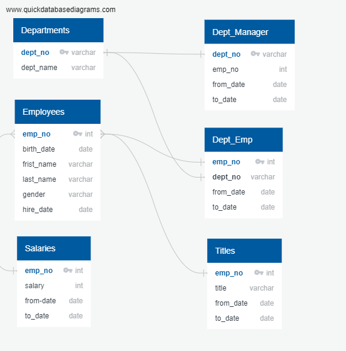
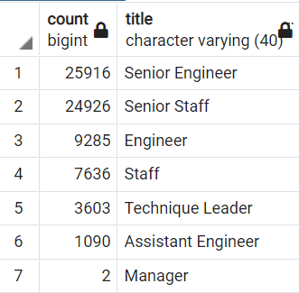

# Pewlett-Hackard-Analysis

## Overview

The purpose of this analysis is to utilize SQL to create tables containing information for the manager of a large business so they can better understand the number of ritement age employees currently working at the company as well as the number of employees who are eligible for their mentorship program. 

## Results

- An ERD (Entity-Relationship Diagram) was utilized to help stay organized and join tables.

- The COUNT() function was utilized to create a table that has the number of retirment-age employees by most recent job title.
- After discovering duplicate entries for some employee counts, the DISTINCT ON statement was used to retrieve only the first occurrence of the employee in the table.

- A mentorship eligibility table was created to determine the number of eligible employees with birth dates between January 1, 1965 and December 31, 1965.

## Summary

Based on the findings, there appear to be enough retirement-ready employees to mentor the next wave of leadership.
